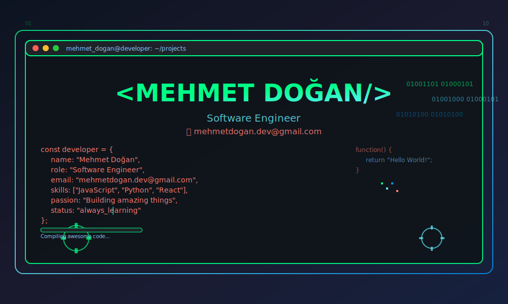
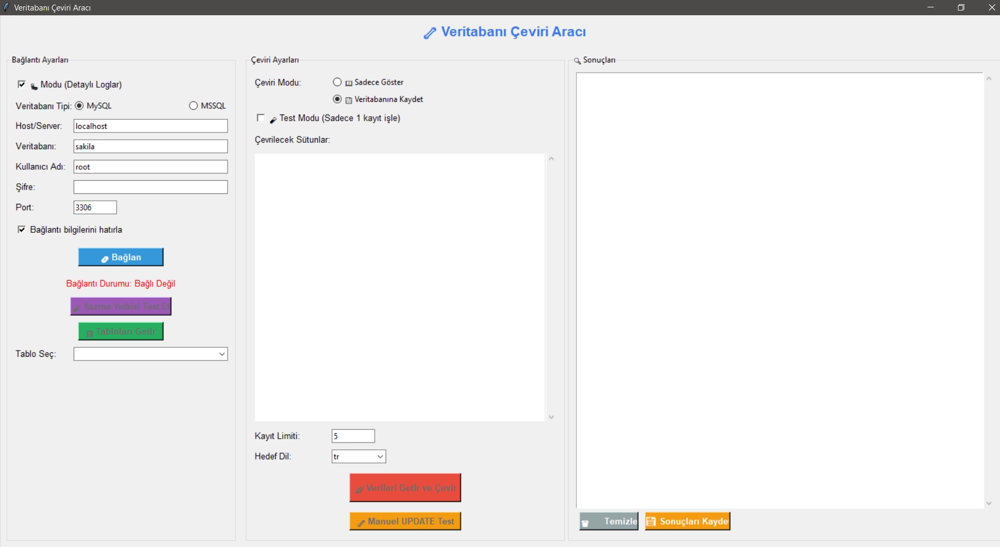
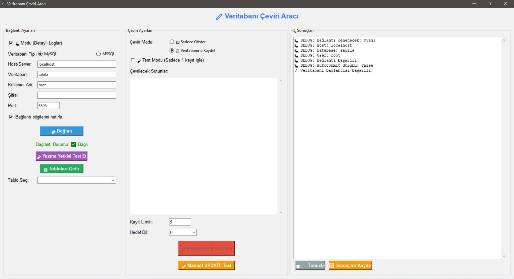
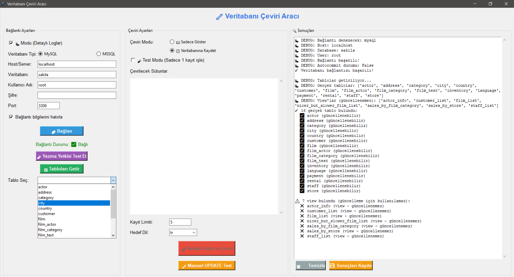
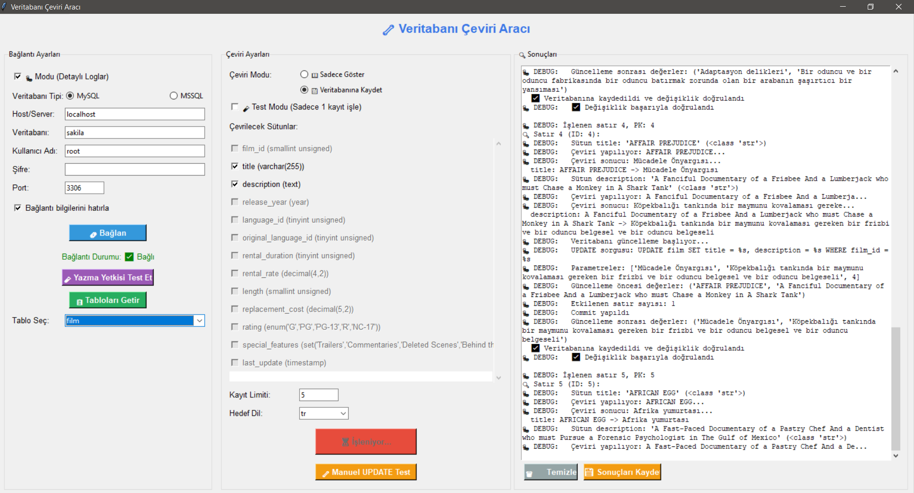
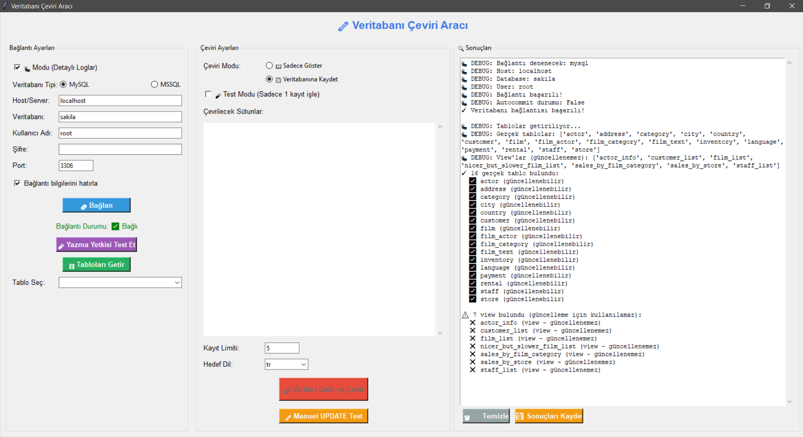

<p align="center">
  
</p>

# 🔧 Database Translate Tool

Veritabanı tablolarını hızlıca çevirin, düzenleyin ve güncelleyin!  
**Database Translate Tool**, MySQL ve MSSQL veritabanlarındaki seçilen tablo sütunlarını otomatik olarak Google Translate üzerinden çevirerek veritabanına kaydetmenizi veya sadece görüntülemenizi sağlar.

---

## 🚀 Özellikler

✅ MySQL & MSSQL desteği  
✅ Sadece text sütunlarını çevirme  
✅ İsteğe bağlı olarak veritabanına kaydetme veya sadece gösterme  
✅ Kullanıcı dostu GUI (Tkinter)  
✅ Test modu (tek kayıt üzerinde çalışma)  
✅ Otomatik bağlantı bilgisi kaydetme

---

## 🖼️ Uygulama Ekran Görüntüleri

### Ana Sayfa


### Bağlantı Ekranı
Veritabanı bağlantısı kurmak için detaylı ayar paneli.


### Tabloları Getirme
Veritabanındaki tabloları kolayca seçebilirsiniz.


### Tablodaki Veriler ve Çeviri
Tablodaki mevcut veriler ve çeviriden sonraki hali.


### Çeviri Önizleme
Sonuçları GUI üzerinden kontrol edebilirsiniz.


---

## ⚙️ Kurulum

```bash
git clone https://github.com/mehmetdogandev/database-translate-tool.git
cd database-translate-tool
pip install -r requirements.txt
